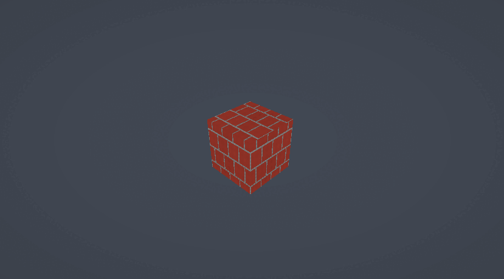

# PCGSamples

Some examples of PCG, to accompany the PCG classes of the [AI for Games Master](https://www.ulusofona.pt/en/lisboa/masters/artificial-intelligence-for-games) program at [Lusofona University](https://www.ulusofona.pt/en).

## Unity

These are the Unity examples we're using.

## Brick shader

## Cloud shader

## Marble shader

## Art assets

[Ground 037](https://ambientcg.com/view?id=Ground037), [CC0](https://docs.ambientcg.com/license/)

## License

[Apache 2.0](LICENSE)
